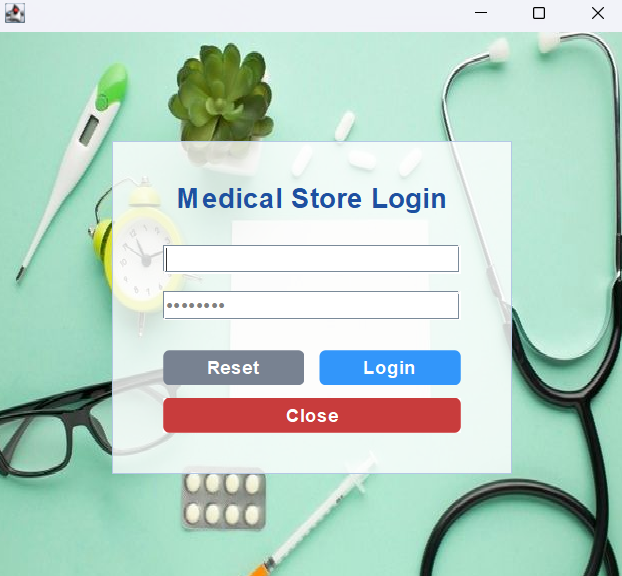

# General Medicine Store

A Java Swing desktop application for managing a medical store — patients, medicines, doctors, prescriptions, and billing — backed by a MySQL database.

---

## Screenshots

### Login


### Dashboard


---

## Features

| Module | What it does |
|---|---|
| **Login** | Username/password authentication against the database |
| **Medicine Inventory** | Add medicines with name, quantity, expiry date, cost; view/search stock |
| **Patient Management** | Register new patients; look up patients by phone with live autocomplete |
| **Doctor Management** | Add, view, and delete doctors; IDs auto-assigned |
| **Issue Medicine** | Select patient (phone autocomplete) + doctor (ID autocomplete) → add medicines → generate prescription |
| **Billing** | Auto-calculates total, deducts stock, saves bill with full DB transaction + rollback on error |
| **Records** | View last 10 transactions with patient, doctor, medicines, total, and timestamp |

---

## Tech Stack

- **Language:** Java (JDK 8+)
- **UI:** Java Swing
- **Database:** MySQL 8.0
- **JDBC Driver:** `mysql-connector-j-9.1.0.jar`
- **Build:** Plain `javac` (no Maven/Gradle)

---

## Project Structure

```
Medical_Store/
├── src/                        # Java source files
│   ├── App.java                # Entry point
│   ├── DatabaseConnection.java # DB connection + auto schema creation
│   ├── Login.java
│   ├── Home.java               # Dashboard (Medicine, Patient, Doctor, Record)
│   ├── MedicineInventory.java
│   ├── AddMedicine.java
│   ├── StockInfo.java
│   ├── PatientInfo.java
│   ├── NewPatient.java
│   ├── PatientDetails.java     # Phone autocomplete dropdown
│   ├── IssueMedicine.java      # Phone + Doctor ID autocomplete dropdowns
│   ├── BillPopup.java
│   ├── DoctorInfo.java         # Add / view / delete doctors
│   └── RecordPage.java
├── bin/                        # Compiled .class files (git-ignored)
├── lib/
│   └── mysql-connector-j-9.1.0.jar
├── icons/                      # UI background and button images
├── .env                        # DB credentials (git-ignored)
├── .env.example                # Template for new setups
├── .gitignore
└── README.md
```

---

## Database Schema

The schema is created automatically on first run — no manual SQL needed.

```
login          (username PK, password_hash)
Doctor         (doctor_id PK AUTO_INCREMENT, name)
Patient        (patient_id PK, name, age, gender, phone UNIQUE, blood_group, address)
Medicine       (medicine_id PK, name UNIQUE, stock_quantity, expiry_date, cost_per_unit)
Prescription   (prescription_id PK, doctor_id FK, patient_id FK, medication TEXT, date_created)
Bill           (bill_id PK, prescription_id FK, patient_id FK, total_amount, date_issued)
```

---

## Setup

### Prerequisites

- Java JDK 8 or higher
- MySQL 8.0 running locally

### 1. Clone the repository

```bash
git clone <repo-url>
cd Medical_Store
```

### 2. Configure credentials

Copy the example env file and fill in your MySQL details:

```bash
cp .env.example .env
```

Edit `.env`:

```
DB_HOST=localhost
DB_PORT=3306
DB_NAME=medicine_store1
DB_USER=root
DB_PASSWORD=your_password
```

> If your MySQL service runs on a non-standard port (e.g. `3307`), update `DB_PORT` accordingly.

### 3. Compile

```bash
javac -cp "lib/mysql-connector-j-9.1.0.jar" -d bin src/*.java
```

### 4. Run

```bash
java -cp "bin;lib/mysql-connector-j-9.1.0.jar" App
```

> **Important:** Run from the project root directory so the app can find `.env` and the `icons/` folder.

On first run, the app automatically:
- Creates the `medicine_store1` database
- Creates all 6 tables
- Seeds a default login (`admin` / `admin`) and a default doctor (`Dr. Sharma`)

---

## Default Login

| Username | Password |
|---|---|
| `admin` | `admin` |

Change this directly in the `login` table after first login.

---

## How to Use

### Adding a Doctor
1. Click **Doctor** on the Home screen
2. Type the doctor's name and press **Add Doctor** or hit Enter
3. The assigned Doctor ID appears in the table — use it when issuing medicine

### Adding Medicine Stock
1. Home → **Medicine** → **Add Medicine**
2. Fill in name, quantity, expiry date (YYYY-MM-DD), and cost per unit
3. Re-submitting an existing medicine name updates its stock and details

### Registering a Patient
1. Home → **Patient** → **New Patient**
2. Fill all fields — phone must be exactly 10 digits

### Issuing Medicine
1. Home → **Patient** → **Issue Medicine**
2. Type the patient's phone — a dropdown shows matching numbers; select to auto-fill the patient name
3. Type the doctor ID — a dropdown shows matching doctors (`ID - Name` format)
4. Select a medicine from the dropdown, enter quantity, click **Add Medicine**
5. Repeat for multiple medicines, then click **Generate Bill**

### Viewing Patient Details
1. Home → **Patient** → **About Patient**
2. Type partial phone number — dropdown shows all matching patients; click to load details

### Viewing Records
1. Home → **Record**
2. Shows the last 10 bills with full details

---

## Environment Variables

| Variable | Description | Default |
|---|---|---|
| `DB_HOST` | MySQL host | `localhost` |
| `DB_PORT` | MySQL port | `3306` |
| `DB_NAME` | Database name | `medicine_store1` |
| `DB_USER` | MySQL username | `root` |
| `DB_PASSWORD` | MySQL password | *(empty)* |

---

## Notes

- `.env` is git-ignored — never commit credentials
- `bin/` is git-ignored — compile locally after cloning
- The MySQL JDBC driver (`lib/mysql-connector-j-9.1.0.jar`) is included in the repo
- Billing uses a DB transaction with full rollback if any medicine has insufficient stock
- Deleting a doctor who has existing prescriptions will fail with a clear error (foreign key constraint)
